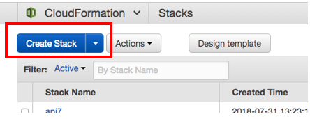
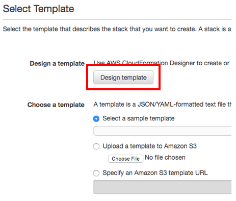
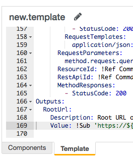
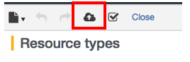

# CloudFormation for Callbacks

This repo contains CloudFormation templates, postman collections for API calls, and JSON schema files for working with Okta Extensibility Callbacks.

Okta Extensibility Callbacks are HTTP callouts that allow you to customize the behavior of Okta during runtime.

To test Okta Extensibility Callbacks, you will need to:

1. Use CloudFormation to set up AWS API Gateway and a Lambda Function to create an API for testing
2. Configure Okta to use the API for testing exposed by API Gateway

## 1. Create an API for testing on AWS

### Deploy from AWS Cloudformation Web Console

Log into AWS Console, select cloudformation, select **Create Stack**

 

Select **Design Template**

  

Paste saml_extension_callback.yaml to the template editor at the bottom of the Designer
**Make sure you have the Designer set to YAML**

  

Then Upload the template with the **Upload Button**

  

Accept the defaults, and name the Stack and Create Stack

When the Cloudformation is deployed, it will return the URI of your API Gateway. <br/>
You will append `/LATEST/commands` to the URI for the next step.

### Deploy from command line:

**Prerequisites:** *To Deploy from the command line you will need to have
AWS CLI tools installed, you can check if they are installed by typing `aws -v`*

```console
aws mb s3://veryuniquebucketname123
```
**NOTE**: This is where the package will be stored before it is deployed. It does not need to be public, this just puts the package somewhere that AWS can pull it from.

Next, we will package the Template and all the required resources.  Run this command:


```console
aws cloudformation package --template-file saml_extension_callback.yaml --s3-bucket veryuniquebucketname --output-template-file output.yml
```

Finally, deploy the Template using the following command:


```consoleaws
aws cloudformation deploy --template-file output.yml --stack-name htmlFromGithubtoS3 --capabilities CAPABILITY_IAM --parameter-overrides bucketname=nameofbuckettosharehtmlin
```

There is also a script include `deploy.sh` which can be used to deploy as well.

`./deploy.sh {yourbucketname} {yourstackname} saml_extension_callback.yaml`

## 2. Use Postman to configure Callback

**Prerequisites:** *You must have Okta Feature Flag "CALLBACK" and "SAML_EXTENSIBILITY" enabled*

Import the Postman Collection into Postman, and change the Provided URI: **line 11** to your API Gateway returned from the Cloudformation

```
{
        "name": "Add SAML attribute",
        "type": {
            "name": "com.okta.tokens.transform",
            "version": "1.0"
        },
        "channel": {
            "name": "HTTP",
            "version": "1.0",
            "config": {
                "uri": "https://yourAPIgatewayURLFromPreviousStep/LATEST/commands",
                "headers": [
                    {
                        "key": "x-api-key",
                        "value": "******"
                    }
                ],
                "method": "POST"
            }
        },
        "debugging": false
    }
```

If your Postman Environment is configured with {url} to your Okta Org, and {apikey} to a valid API Key, and run the Collection you should get a result similar to below

```
{
    "id": "calejn8qu4wzB4MYO355",
    "status": "ACTIVE",
    "name": "Add SAML attribute",
    "type": {
        "name": "com.okta.tokens.transform",
        "version": "1.0"
    },
    "channel": {
        "name": "HTTP",
        "version": "1.0",
        "config": {
            "uri": "https://oec4atmp4e.execute-api.us-east-1.amazonaws.com/LATEST/commands",
            "headers": [
                {
                    "key": "x-api-key",
                    "value": "******"
                }
            ],
            "method": "POST"
        }
    },
    "debugging": false,
    "debuggingStartTime": null,
    "created": "2018-07-31T19:53:14.000Z",
    "lastUpdated": "2018-07-31T19:53:14.000Z"
}
```  
